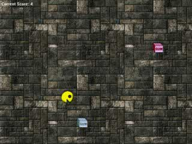



## A Cool and Complete DirectX Game \(part 1\)

### Description

This a pretty cool game that uses Direct Draw, Direct Sound, and Direct Music from the DirectX API. It demonstrates how to create simple character animations as well as showing you how to create sounds when certain events occur and how to play midi files in gameplay. This is definitely a must see! A vote will be most appreciated! (PSC Admin note: Requires Part 1,2,3,4 to work!)
 
### More Info
 

             |
---                |---
**Submitted On**   |2000-07-14 22:24:00
**By**             |[Jason Shimkoski](https://github.com/Planet-Source-Code/PSCIndex/blob/master/ByAuthor/jason-shimkoski.md)
**Level**          |Intermediate
**User Rating**    |4.9 (102 globes from 21 users)
**Compatibility**  |VB 3\.0, VB 4\.0 \(16\-bit\), VB 4\.0 \(32\-bit\), VB 5\.0, VB 6\.0, VB Script, ASP \(Active Server Pages\) 
**Category**       |[Games](https://github.com/Planet-Source-Code/PSCIndex/blob/master/ByCategory/games__1-38.md)
**World**          |[Visual Basic](https://github.com/Planet-Source-Code/PSCIndex/blob/master/ByWorld/visual-basic.md)
**Archive File**   |[CODE\_UPLOAD78277152000\.zip](https://github.com/Planet-Source-Code/jason-shimkoski-a-cool-and-complete-directx-game-part-1__1-9798/archive/master.zip)

